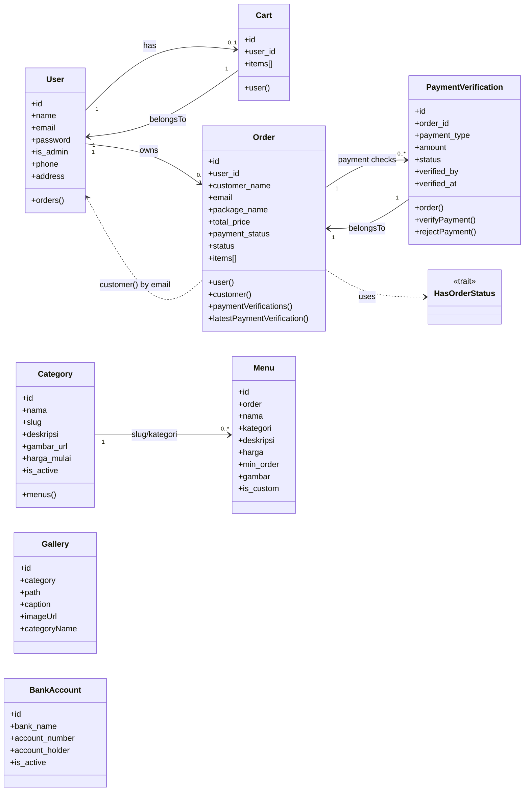

# Class Diagram

Notes:
- `Category.menus()` links `categories.slug` to `menus.kategori`.
- `Order.customer()` matches `orders.email` to `users.email`.
- `Gallery` and `BankAccount` are standalone models in this diagram.